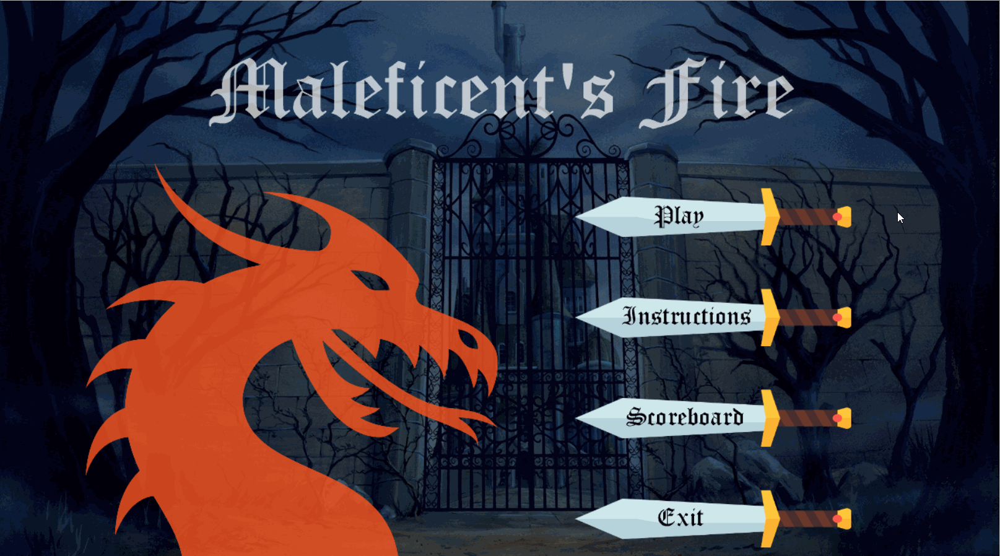

# Tetris
A Disney's Sleeping Beauty themed Tetris game called "Maleficent's Fire" created in C# using MonoGame that follows the rules of Tetris but with added obstacles and power-ups that appear throughout the game. The game was originally created for a computer science ISU (Independent Study Unit) project.

The following GIF shows a preview of the game with its menu and a single clear:

